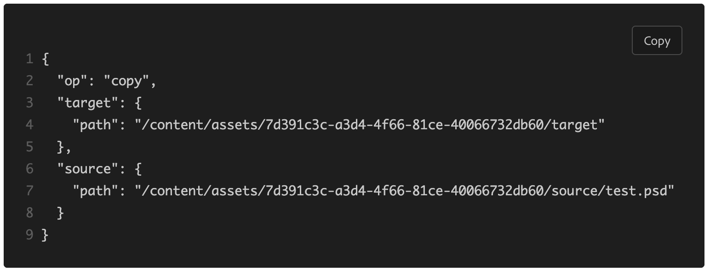
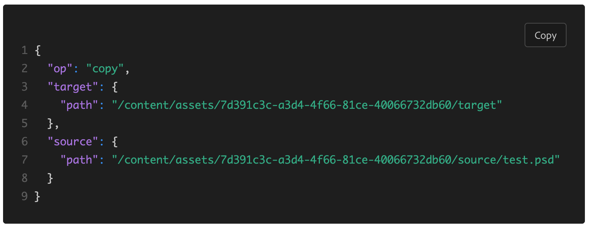
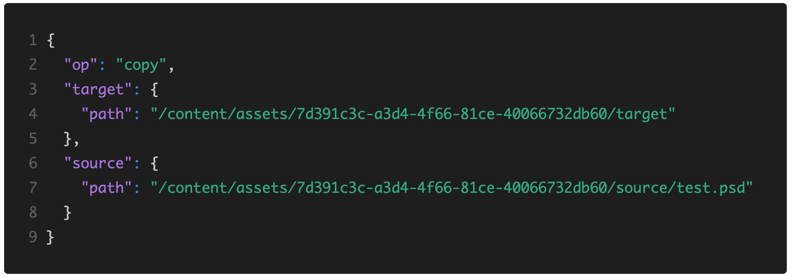
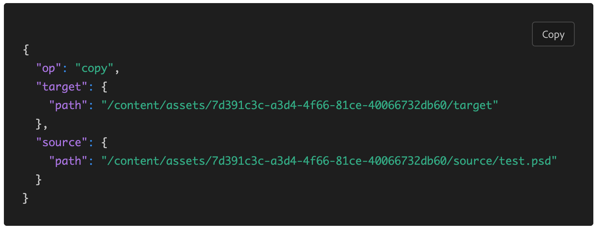
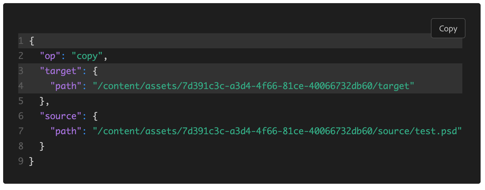

# Code

Component that displays source code snippets.

## Props

| Name        | Type      | Default | Description                                                                                                           |
| ----------- | --------- | ------: | --------------------------------------------------------------------------------------------------------------------- |
| children    | ReactNode |       - | The code to be displayed in the component.                                                                            |
| className   | string    |       - | The class name used to style the component. Typically, `language-` followed by the type of code i.e. `language-json`. |
| theme       | string    |    dark | Should the component use dark or light theme.                                                                         |
| copyButton  | boolean   |    true | Whether the component should have a copy button.                                                                      |
| lineNumbers | boolean   |    true | Whether the component should have line numbers.                                                                       |
| metastring  | string    |       - | Options passed into the component from markdown.                                                                      |

## Examples

### Default example

```jsx
<Code>
{
  "op": "copy",
  "target": {
    "path": "/content/assets/7d391c3c-a3d4-4f66-81ce-40066732db60/target"
  },
  "source": {
    "path": "/content/assets/7d391c3c-a3d4-4f66-81ce-40066732db60/source/test.psd"
  }
}
</Code>
```



### Class Name example

```jsx
<Code className='language-json'>
{
  "op": "copy",
  "target": {
    "path": "/content/assets/7d391c3c-a3d4-4f66-81ce-40066732db60/target"
  },
  "source": {
    "path": "/content/assets/7d391c3c-a3d4-4f66-81ce-40066732db60/source/test.psd"
  }
}
</Code>
```



### Copy Button example

```jsx
<Code className='language-json' copyButton={false}>
{
  "op": "copy",
  "target": {
    "path": "/content/assets/7d391c3c-a3d4-4f66-81ce-40066732db60/target"
  },
  "source": {
    "path": "/content/assets/7d391c3c-a3d4-4f66-81ce-40066732db60/source/test.psd"
  }
}
</Code>
```



### Line Number example

```jsx
<Code className='language-json' lineNumbers={false}>
{
  "op": "copy",
  "target": {
    "path": "/content/assets/7d391c3c-a3d4-4f66-81ce-40066732db60/target"
  },
  "source": {
    "path": "/content/assets/7d391c3c-a3d4-4f66-81ce-40066732db60/source/test.psd"
  }
}
</Code>
```



### Highlight Lines example

```jsx
<Code className='language-json' metastring="{1,3-4}">
{
  "op": "copy",
  "target": {
    "path": "/content/assets/7d391c3c-a3d4-4f66-81ce-40066732db60/target"
  },
  "source": {
    "path": "/content/assets/7d391c3c-a3d4-4f66-81ce-40066732db60/source/test.psd"
  }
}
</Code>
```



## Markdown Examples

### Default Markdown example

````
    ```
    {
      "op": "copy",
      "target": {
        "path": "/content/assets/7d391c3c-a3d4-4f66-81ce-40066732db60/target"
      },
      "source": {
        "path": "/content/assets/7d391c3c-a3d4-4f66-81ce-40066732db60/source/test.psd"
      }
    }
    ```
````


### Class Name example

````
    ```json
    {
      "op": "copy",
      "target": {
        "path": "/content/assets/7d391c3c-a3d4-4f66-81ce-40066732db60/target"
      },
      "source": {
        "path": "/content/assets/7d391c3c-a3d4-4f66-81ce-40066732db60/source/test.psd"
      }
    }
    ```
````


### Copy Button example

````
    ```json {copy: false}
    {
      "op": "copy",
      "target": {
        "path": "/content/assets/7d391c3c-a3d4-4f66-81ce-40066732db60/target"
      },
      "source": {
        "path": "/content/assets/7d391c3c-a3d4-4f66-81ce-40066732db60/source/test.psd"
      }
    }
    ```
````


### Line Number example

````
    ```json {numberLines: false}
    {
      "op": "copy",
      "target": {
        "path": "/content/assets/7d391c3c-a3d4-4f66-81ce-40066732db60/target"
      },
      "source": {
        "path": "/content/assets/7d391c3c-a3d4-4f66-81ce-40066732db60/source/test.psd"
      }
    }
    ```
````


### Highlight Lines example

````
    ```json {1,3-4}
    {
      "op": "copy",
      "target": {
        "path": "/content/assets/7d391c3c-a3d4-4f66-81ce-40066732db60/target"
      },
      "source": {
        "path": "/content/assets/7d391c3c-a3d4-4f66-81ce-40066732db60/source/test.psd"
      }
    }
    ```
````


